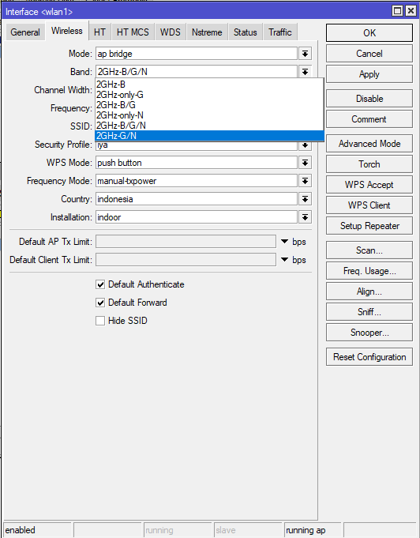

# LAB-36-Wireless 802.11a/b/g/n/ac, Band, Channel dan Data Rate
Kamis 21 Agustus 2025  
  
# Band  
  Band adalah rentang frekuensi kerja yang digunakan perangkat wireless untuk melakukan komunikasi data. Pada mikrotik, band yang tersedia menyesuaikan dengan standar IEEE 802.11, yaitu sekumpulan protokol jaringan wireless yang dikembangkan oleh Institute of Electrical and Electronic Engineers (IEEE). Protokol 802.11 ini mengatur cara perangkat mengakses media wireless, cara trsnamisi data, kecepatan maksimal, teknik modulasi, hingga kompabilitas antar perangkat.  
  Ada beberapa Band di router MikroTik.  
  **1. 2Ghz-b**  
    Bekerja di frekuensi 2,4Ghz. Menggunakan protokol 802.11b dengan data rate maksimum 11 Mbit/s.   
  **2. 2Ghz-b/g**  
    Bekerja di frekuensi 2,4Ghz. Menggunakan protokol 802.11b akan tetapi melakukan transmisi dengan berbasis OFDM seperti 802.11a sehingga protokol 802.11g bisa mencapai 54 Mbit/s.  
  **3. 2Ghz-b/g/n**  
    Bekerja di frekuensi 2,4Ghz. Menggunakan Protokol 802.11b, 802.11g dan 802.11n. Pengembangan dari standard protokol 802.11, ditambah dengan kemampuan multiple-input multiple-output (MIMO). Dengan tambahan fitur MIMO ini, secara teori maksimal data rate yang bisa dicapai adalah 300Mbit/s.  
  **4. 2Ghz-only G**  
    Bekerja di frekuensi 2,4Ghz, hanya menggunakan protokol 802.11g.  
  **5. 2Ghz-only N**  
    Bekerja di frekuensi 2,4Ghz, hanya mengunakan protokol 802.11n.  
  **6. 5Ghz-a**  
    Bekerja di frekuensi 5Ghz. Mengunakan protokol 802.11a, maksimum data rate yang bisa dicapai adalah 54 Mbit/s.  
  **7. 5Ghz-a/n**  
    Bekerja di frekuensi 5Ghz. Mengunakan protokol 802.11a dan 802.11n.  
  **8. 5Ghz-only N**  
    Bekerja di frekuensi 5Ghz dan hanya mengunakan protokol 802.11n.  
      
# Protokol-protokol IEEE  
  **1. 802.11g**
    Bekerja di frekuensi 2.4 Ghz, Maksimun data rate 11 Mbit/s, jangkauan relatif luas karna frekuensi 2,4 Ghz mudah menem bus penghalang, tapi lebih rentan interferensi, karna 2,4Ghz juga dipakai perangkat lain seperti bluetooth, microwave.  
  **2. 802.11g**  
    Bekerja di frekuensi 2.4 Ghz. Maksimun data rate 54 Mbit/s, Lebih cepat dari 802.11b, tetap backward compatible dengan 802.11b, performa meningkat di 2.4 Ghz, dan tetap rentan interferensi karna masih di frekuensi 2,4 Ghz.  
  **3. 802.11n**  
    Bekerja di frekuensi 2.4 Ghz dan 5 Ghz. Maksimum data rate hingga 300M atau bahkan 600 Mbps dengan channel bonding 40 Mhz + 4 antena MIMO. Dengan MIMO (Multiple input Multiple Output) yang memanfaatkan banyak antena untuk mengirim & menerima data sekaligus. Channel Bonding 20 sampai 40 Mhz, memperbesar kanal sehingga throughput lebih besar.  Kecepatan lebih tinggai, sudah cukup untuk kebutuhan internet rumah atau kantor kecil. Kekurangannya jika kapai 2,4 Ghz masih ada interferensi, jika 5 Ghz jangkauannya lebih pendek.  
  **4. 802.11a**  
    Bekerja di frekuensi 5Ghz. Maksimum data rate 54 Mbps. Lebih sedikit interferensi karna 5 Ghz jarang dipakai, jangkauanpendek  karena sinyal 5 Ghz sulit menembus tembok. Stabil di area paadt interferensi.  
  **5. 802.11ac (wave 1&2)**  
    Hanya bekerja di frekuensi 5 Ghz. Maksimun data rate wave 1 hingga 1.3 Gbps dan Wave 2 hingga 3.5 Gbps. dengan MU-MIMO (Multi User MIMO) yang dapat melayani banyak user secara pararel. Channel width lebih besar, 60 Mhz hingga 160 Mhz. Beamforming, memokuskan sinyal ke klien tertentu untuk stabilitas. Kecepatan tinggi, cocok untuk kebutuhan modern seperti streaming 4K, gaming atau kantor), kekurangannya jangkauan tetap terbatas karna 5 Ghz.  
  **6. 802.11ax (WIFI 6 dan 6E)**  
    Bekerja di frekuensi 2.4 Ghz, 5 Ghz sampai 6 Ghz. Maksimum data rate hingga 9.6 Gbps, mengunakan OFDMA (Orthogonal Frequency Division Multiple Access) bagi channel jadi sub-channel agar lebih efisien. Target Woke Time (TWT) yang membuat hemat baterai device IoT, dan MU-MIMO lebih optimal. Stabil, cepat, efisien, banyak klien bisa dilayani. Kekurangannya masih mahal dan butuh perangkat klien yang support.  

# Konfigurasi Band dan Frequency pada Mikrotik
  Kita dapat melakukan konfigurasi Band di MikroTik di **wireless > WiFi intrface > pilih interface (wlan1) > Wireless**  
    
    

  Dan kita juga dapat melakukan konfigurasi Frequency di MikroTik di **wireless > WiFi intrface > pilih interface (wlan1) > Wireless**  
    
    
    
# Channel  
  Channel adalah pembagian frekuensi dalam satu band yang digunakan untuk transmisi WiFi.  
Seperti jalan raya, Band itu adalah jalan besar dan Channel itu laju jalur. Jadi kalau banyak mobil di lajur yang sama akan macet. Begitu juga dengan WiFi, kalau banyak AP yang pakai channel sama akan interferensi.  

**2.4 GHz**  
  Band 2.4 Ghz punya 14 channel (dari 2.412 Ghz sampai 2.484 Ghz). Dipisah setiap 5MHz dan tiap channel lebarnya 20 MHz, masalahnya channel ini tumpang tinduh (overlap). Contoh, Channel 1 (2.412 GHz) rentang 2.402 - 2.422 GHz. Channel 2 (2.417 GHz) rentang 2.407 - 2.427 GHz. Hasilnya ada area 15 MHz yang sama jadi overlap.  
  Supaya tidak overlap, gunakan channel dengan jarak jauh,  
  - Channel 1 (2.412 GHz)  
  - Channel 6 (2.437 GHz)  
  - Channel 11 (2.462 GHz)

**5 GHz**  
  5 GHz punya jumlah lebih dari 25 channel, rentangnya 5.150-5.825 MHz. Jarak antar channel lebih lebar jadi minim overlap. Pembagian channelnya,  
  - UNII-1 (36-48 / 5.180-5.240)  
    Bebas pakai indoor, tidak perlu DFS.  
  - UNII-2 (52-140 / 5.260-5.700)  
    Wajib DFS (Dynamic Frequency Selection), AP harus cek dulu apakah ada radar, CAC (Channel availability check) delay 60 detik.  
  - UNII-3 (149-165 / 5.745-5.825 GHz)
    Bisa dipakai indoor, tidak perlu DFS.
  Kelebihannya Banyak channel, lebih fleksibel, hampir tidak ada overlap, bisa pakai channel width besar (40/80/160 MHz). Kekurangannya adalah jangkauannya pendek, mudah terhalang tembok, perangkatlama tidak support.

# Channel Width
  Channel width atau lebar jalur adalah seberapa lebar jalur frekuensi yang dipakai.  
  - 20 MHz, standar, stabil, cocok area padat.  
  - 40 MHz, Gabungan antara 2 channel, lebih cepat lebih dan mudah tabrakan.  
  - 80 MHz, dipakai di WiFi 5, sangat cepat.  
  - 160 MHz, dipakai di WiFi 6, throughput tinggi, tapi butuh channel kosong.

# Konfigurasi Channel pada Mikrotik
  Kita dapat melakukan konfigurasi channel di MikroTik pada **wireless > WiFi intrface > pilih interface (wlan1) > Wireless**  
    
    
    
# Data Rate
  Data rate adalah kecepatan maksimum yang bisa dicapai dalam transmisi data wireless antara AP dan Client. Data rate ditentukan oleh standar WiFi yang digunakan (misalnya 802.11b/g/n/ac/ax), lebar channel (20/40/80/160 MHz) dan jumlah antena/spartial stream (1x1, 2x2, dst).    
  
**Perbedaan data rate teori dan nyata.**  
1. Data Rate Teori (Theoretical Maximum), adalah angka tertinggi diatas kertas dihitunh dari kombinasi modulation, coding date, channel width, dan jumlah antena.  
2. Data Rate rata-rata (Real Throughput) adalah kecepatan yang benar-benar bisa dirasakan user saat download/upload.  
  Dalam praktiknya, real thoughput hanya sekitar 40-60% dari angka teoritis, karena sebagian bandwidth dipakai untuk overhead protokol.  

**Faktor yang membuat Data rate lebih rendah**  
1. Channel width, semakin lebar, semakin cepat tapi semakin mudah terganggu interferensi.  
2. Jumlah pengguna, kalau banyak device terkoneksi ke AP, bandwidth dibagi rata.  
3. Jarak dan halangan fisik, semakin jauh dari AP dan semaik ada tembok tebal, throughput semakin turun.  
4. Kualitas sinyal, kalau sinyal lemah, noise tinggi, modulasi otomatis turun ke level rendah.  
  
# Pembahasan
  
**Interferensi**
  Interferensi adalah gangguan pada sinyal wireless yang terjadi karena ada gelombang frekuensi lain yang saling tumpang tindih (overlap) atau saling bertabrakan. Karna wireless bekerja pakai gelombang radio, maka kalau ada banyak perangkat lain mengunakan frekuensi sama, sinyal akan terganggu.  
  Dampak Interferensi, Sinyal lemah atau tidak stabil walau dekat, KEcepatan internet turun drastis, ping naik atau latency tinggi, packet loss (data tidak sampai) sering disconnect.  

**Overlap**  
  Overlap adalah ketika dua channel berbagi sebagian frekuensi yang sama, akibatnya sinyal bisa saling terganggu. Cohtohnya channel 2 (2.417 GHz) dan Channel 3 (2.422 GHz) saling overlap jadi client yang connect bisa mengalami interferensi.  

# Kesimpulan  
  Band adalah rentang frekuensi yang digunakan wireless, channel adalah pembagian frekuensi dalam satu band, dan data rate adalah kecematan maksimal yang bisa dicapai. Semakain besar range atau channel width yang digunakan maka semakin besar pula troughput bandwith yang bisa dilewatkan. 

# Sumber
Citraweb - citraweb.com/artikel_lihat.php?id=70
         - citraweb.com/artikel/144/
